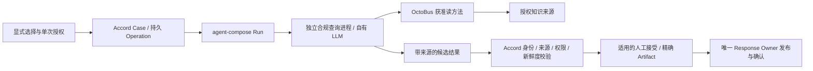

# Accord 只读接管回执 — 2026-09-11

本回执只记录本轮核验、文档修补建议及未批准的后续里程碑草案。依据本轮用户请求，仅新建本文件；已有 docs/handoff-receipt.md 保留。未执行产品测试、安装、构建、服务启动、真实模型、OctoBus 或客户系统调用；未读取凭据内容、操作数据库或旧运行进程，未提交、推送或写 GitHub。

## 结论与真实基线

- cwd：/Users/yet/Developer/Accord；分支：codex/r004-sas-dialogue；HEAD：2668ee62f249d462930bd980c8178ce5f24f7f6e。
- 本轮 gh API 查询的 [远端 main](https://github.com/Notyet1307/Accord/commit/2668ee62f249d462930bd980c8178ce5f24f7f6e) 与 HEAD 相同；这不表示工作树等于 main。
- 已有 9 个 tracked 修改：AGENTS.md、README.md、docs/agents/issue-tracker.md、docs/product/VISION.md、package.json、scripts/check-no-external-seams.mjs、scripts/validate-ci.sh、scripts/validate-project.sh、src/contracts/magicchat.ts。
- 已有 11 个 untracked 文件：ADR-0004、docs/architecture.md、docs/development.md、旧回执、R004 Release、r004-sas-contact-dialogue Spec、sas-conversational-agent-pilot Spec、docs/work/current.md、src/contracts/sas-dialogue.ts、src/driver/r004-dialogue.ts、test/r004-dialogue.integration.test.ts。全部保留。
- git worktree list 显示当前树及 9 个既有 C2/C3、历史 Controller 工作树；本轮不进入其运行状态、不清理或切换。
- 实际祖先路径 /AGENTS.md、/Users/AGENTS.md、/Users/yet/AGENTS.md、/Users/yet/Developer/AGENTS.md 均未发现文件；仓库内 rg --files -g AGENTS.md 仅返回根文件。当前根规则与用户提供的全局规则共同适用；用户本轮“仅调查及回执”是权限上限，旧文档中的实施授权不扩大本轮权限。
- 读取四份 docs/agents 规则、当前导航、R003/R004 Release、ADR-0002/0003/0004、相关 C4/live/R004 Spec、关联源代码及测试。Vision 按需核验权威表和当前围栏；Lody 研究仅用于既有运行术语和恢复边界，不重启 Lody 路线。

**编号冲突已明确：R004 在本地已有 SAS 对话试点，Release/ADR 标记 ACCEPTED，根规则也选定它。** 其文件未提交到当前 main；本轮没有重建或伪造其用户接受记录。用户本次明确的合规方向作为后续提案，不静默替换 SAS 既有决定。建议新提案暂用 **R005 候选：首个外部只读智能体业务闭环**；当前 Release 文件枚举中无 R005，正式发布前仍需重核编号和由产品负责人确认其与 R004 的顺序。无需重问已经明确的产品方向。

绑定本地候选字节（SHA-256）：

| 文件 | 摘要 |
| --- | --- |
| docs/product/releases/r004-sas-conversational-agent-pilot.md | e50565498cda10df6d288a67116d1197cd6b0189dba667d8901ee055c84838b9 |
| docs/adr/0004-sas-conversational-agent-boundary.md | a65f549618e0a86c7e72e779a94d3cd9602b3fb8256c145cdd613b4240bd2505 |
| docs/specs/r004-sas-contact-dialogue.md | 4d87263a2579c633f0fa47b93994673d71e6af29ee58231ac441f22371d04623 |

## GitHub 当前事实及证据等级

本轮 gh issue list --state open 和 gh pr list --state open 均返回空列表。没有当前开放任务入口，不复活旧队列。

- [#44](https://github.com/Notyet1307/Accord/issues/44) 实际 CLOSED，closedAt=2026-09-08T20:38:19Z，仍带 needs-triage；正文仍称 Spec 准备、保持 OPEN。以状态字段与[最新关闭评论](https://github.com/Notyet1307/Accord/issues/44#issuecomment-5591544717)为当前事实：实现已由 [PR #66](https://github.com/Notyet1307/Accord/pull/66) 交付。正文与标签不构成现在的状态或授权。
- #70/#71/#72 已关闭，对应 #74/#75/#76 已合并；#67 的 C4 加固由 #68 合并。Issue 全关不证明 Release 全部验收。
- [PR #76](https://github.com/Notyet1307/Accord/pull/76) 记录精确 PR head 7446f9163d6382c598e58998f1b1ef3d5a784b1b 的 operator qualification：303/303、7 项边界探针。此为本轮读取到的远端证据索引；本轮未重新核验本机原始执行日志及其哈希。
- PR #76 的真实正常链路发生于实现 SHA 5911c2042497debb9c5258953d93acc6a3550bb6：四个 winner、实际人工批准、一个服务端确认发布、ACK 7；PR 同时明确真实注入 crash windows 未执行。不得提升为当前脏树或完整 R003 的证明。
- [合并后 CI 34437515254](https://github.com/Notyet1307/Accord/actions/runs/34437515254) 当前 SUCCESS，headSha 为 2668ee62…；workflow Herdr delivery gate、check herdr-delivery-gate 保留。PR CI 的 merge-test commit 与真实 PR head qualification 是两种不同证据。
- 旧本地导航所述 314 项离线测试、SAS 跨仓任务状态属于旧快照；本轮未读取其原始 manifest/日志或重新查询 SAS 全部任务，不作为本轮通过结果。

## OMP、Matt Skills 与开发入口

OMP 已安装；不能以缺少 .omp 推断不可用，也不能称本会话已经由 OMP 执行。

| 层次 | 本轮静态事实 | 未证明事项 |
| --- | --- | --- |
| OMP 安装 | /opt/homebrew/bin/omp → /opt/homebrew/Cellar/omp/18.1.17/bin/omp；formula/receipt 为 18.1.17、arm64、can1357/tap | 未启动 OMP |
| 完整性 | 二进制 SHA-256 1c310974d4be8de4e5b7285e9c52647321b412c219790fe0243cf804d5c9d5cc 与本机安装 formula 匹配 | 不替代全部功能验收 |
| 依赖 | receipt runtime_dependencies=[]；node/bun/pnpm/gh 命令路径存在 | 版本兼容、模型连通和所有工具可用未测 |
| 配置/插件 | ~/.omp/agent/config.yml 存在；仅白名单检查 Skills/扩展键；插件包列 Ponytail 4.9.0 | 未读模型/凭据设置；启动参数和覆盖未知 |
| Matt | ~/.agents/skills；~/.agents/.skill-lock.json 格式 v3，来源 mattpocock/skills 41 条，33 个对应文件存在 | 无统一版本/上游 commit；lock 不是加载清单 |
| 会话 | 当前 Codex catalog 暴露 code-review、tdd、diagnosing-bugs 等 | Codex 发现不等于 OMP 实际加载 |

[OMP v18.1.17 skills.ts](https://github.com/can1357/oh-my-pi/blob/v18.1.17/packages/coding-agent/src/extensibility/skills.ts) 与 [agents.ts](https://github.com/can1357/oh-my-pi/blob/v18.1.17/packages/coding-agent/src/discovery/agents.ts) 默认启用用户/项目 Agents Skills，扫描用户级 .agent/skills、.agents/skills 及项目祖先。本机 ~/.agents/skills 存在，Accord 和 Developer 无项目 .agents；缺少项目配置不妨碍默认发现。实际加载、同名覆盖、警告需后续获准的启动发现验收，不能现在补写 PASS。

Matt lock 缺失文件：batch-grill-me、design-an-interface、edit-article、obsidian-vault、qa、request-refactor-plan、ubiquitous-language、writing-great-skills。writing-for-agents 存在但无同名 Matt lock；不自动修复或安装。code-review/SKILL.md 本轮哈希 7b2611d766ed7b9f375e73c821c7727535a6c036cf66870882770cd5a8188f70。

已符合的规则：单一版本 Spec / GitHub 任务 / SHA 绑定 PR 证据；授权按动作区分；旧 Planner/Controller 非当前入口；CI 与 operator 分级；无假批准、无静默 fallback、外部输出默认候选；领域文件惰性创建。此次只读工作委派两个互不依赖的只读核验子任务，主会话复核入口和关键证据；没有 OMP 执行记录，不能编造。

## 验证执行计划（本轮全部不执行）

| 级别 | 实际入口 | 环境、写入与副作用 | 允许证明 |
| --- | --- | --- | --- |
| 普通 CI | GitHub 先 npm ci --ignore-scripts --no-audit --no-fund，再 ./scripts/validate-ci.sh | .node-version 固定 Node 24.19.0；package 固定 npm 11.17.0；需要 TMPDIR/RUNNER_TEMP；安装可能联网，构建改 dist、创建临时 SQLite/子进程，C4 杀死自有测试 worker | 对受测 SHA 的离线回归 |
| operator 本地资格 | operator-owned launcher → ./scripts/validate-delivery.sh → validate-project.sh | 解释仓库 shell 之前建立无网/文件隔离；私有 TMPDIR、只读离线 cache；内部 npm ci --offline 会物化依赖；需要真实 BOUNDARY 和 launcher/profile 哈希 | 精确提交的可信本地资格，不证明真实外部行为 |
| R003 真实联调 | node scripts/run-r003.mjs --live --database <绝对路径> --config <绝对路径> --credentials <绝对路径> | 先构建；0600 当前 uid 凭据；写 SQLite/WAL；MagicChat 网络、收费模型、可见发消息。--retry-unknown 是独立授权动作 | 仅实际运行场景；正常链路不是故障验收 |
| 新外部链路 | 尚无获批可执行 Accord 入口 | R004Dialogue 只允许 offline；合规运行/OctoBus/guest 组合未核验，不伪造 endpoint 或一键命令 | 暂仅有源码合同线索 |

未来执行顺序：先固定代码/Spec/运行版本和范围 → 无外部调用的离线保护测试 → 对精确候选做可信 operator qualification → 另行批准合成数据、网络、模型和预算的真实接缝及故障窗口。仅改文档不需要重跑产品测试。保留工作流名称和已有有效测试；测试脚本存在不等于已经执行。

## 最小逐文件修补建议（未应用）

| 文件 | 当前情况 | 最小建议 |
| --- | --- | --- |
| README.md | main 固定 C4 入口过期；当前未提交版本已经链接 current/development/architecture | 复用现有候选，不再重写。批准时仅校正文案区分“本地 R004 候选 / main / 后续提案”，保留资格说明 |
| docs/agents/issue-tracker.md | main 仍指定 #44 准备；当前候选已改为导航和历史 C4 | 复用该 diff；保留 GitHub 状态与原始评论，不重建任务图 |
| docs/work/current.md | 已存在，导航意图正确 | 将快照时间、旧证据测试版本与未提交范围写清；新提案只给链接，不复制开放/关闭账本 |
| docs/handoff.md | 不存在，旧 handoff-receipt 已承担快照用途 | 不新增同义报告；保留旧回执，导航链接本日期回执。后续快照绑定 SHA/Spec digest |
| docs/development.md | 已存在三类入口 | 补 operator 内部安装和 CI 临时文件/worker 副作用；314 测试数绑定旧 manifest；增加 OMP 安装与实际加载的区别 |
| docs/agents/skill-usage.md | 不存在 | 建议仅新增短表：code-review→固定基点/Spec/双审查；diagnosing-bugs/tdd→定位及授权后测试；to-spec→仓库合同；to-tickets/triage→只有授权才写 GitHub。链接 delivery-gate/tracker/domain，不复制技能 |
| CONTEXT.md | 不存在 | 此次出现“领域角色 vs R003 四 Profile”“capset vs 用户授权”实质歧义，建议后续加下节短词表；不创建 CONTEXT-MAP |
| AGENTS.md / VISION / architecture / 已接受 R003/R004 Spec/ADR | 已有权威与架构材料 | 本轮不修改。Vision 权威表仍写配置 Harness，而 delivery-gate 已选 OMP，建议未来只修此一处执行事实指针；新外部边界另立后续 ADR，不重写历史 |

不新增第二份 product、architecture、mvp Spec，不重排目录；不复制全量 Matt Skills，不配置 memory/autolearn、全局 OMP 或后台运行。现有 SAS 总体 Spec 与任务 Spec 的导航层级需保持明确，不为新合规业务再造第三份同义合同。

建议词义：Profile 是身份/声明/策略的版本，不是授权；领域角色是“合规资料研究员”的业务含义，不等于 RESEARCHER 等固定认知阶段；Binding 是选定 runtime、执行配置/模型/凭据引用与版本；单次授权是主体/资源/能力/期限/预算的明确范围；Activity 是 Case 内贡献；Operation 是 Accord 先持久接受的命令；agent-compose Run 是外部执行事实；Session 是执行会话引用；capset 是外部 method binding 集合，既不等于角色，也不自动赋予主体访问客户资料或管理权限。

## R003 剩余验收与后续依赖

源码/测试存在不等于本轮 PASS。C4 synthetic-intake.conformance.test.ts 含 happy/model-unknown/publication-unconfirmed、SIGKILL/new PID 场景；Driver 测试含 UNKNOWN、显式重试、回执恢复；external-transports 测试含超时、身份/边界、无自动 HTTP retry。PR #76 保留真实正常链路和曾经失败的 UNKNOWN/502，不改写历史结果。

R003 完整资格仍缺真实受控“模型提交后结果不明”和“message.send 被接受后确认前”崩溃恢复证据，见 ADR-0003 与 r003-live-qualification.md。需按完整 Release 再核查同一冻结 Case、来源/审查、精确批准、唯一可见发布及 Trace，不能用一次重连成功替代故障窗口。

| 项目 | 对后续候选的依赖 |
| --- | --- |
| 外部调用前持久接受、指纹/冻结配置、恢复 UNKNOWN | 首条外部接缝硬依赖；必须用新 runtime 验证 |
| 身份冲突、重复/迟到/陈旧输出、唯一发布和确认不明 | 首条业务闭环硬依赖；真实发布验收覆盖相关窗口 |
| 来源资格、权限映射、跨用户隔离、外发边界 | 首条查询硬依赖；R003 synthetic 证据接受不能替代 |
| R003 四角色完整真实故障活动 | 不阻塞本次研究/草案；独立保留未完成，不因新候选通过而关闭 |
| 多副本/灾备/平台化 | 本轮及首里程碑不建设 |

R003 Driver 的 acceptSyntheticEvidence（src/driver/r003-driver.ts:104）和 researcher-analyst.ts:830 精确匹配批准合成来源字段；其权限默认 deny-all。不能添加一条真实 source manifest 便声称外部证据已合法接入。R004 SAS 只读回复免逐条批准的已接受规则也不能自动适用于新的合规“已接受证据/正式 Artifact”。

## 后续 Release 候选草案：外部只读智能体业务闭环

以下均为建议，非 ACCEPTED Release、Spec 或实施授权。

目标：用户显式选择一个合规查询智能体，在一个受控非生产 Case 内提出问题、补充范围、获得带来源与局限的候选回答，经确定性证据资格校验和适用的人类接受步骤后，仅发布一份关联完整的结果。五个支持域为等保、关基保护、安全政策、行业知识、商用密码应用安全性评估；先用一条有授权来源的合成等保问题验证闭环，其他领域保持明确覆盖声明和数据缺口。

Accord 保留 TypeScript、SQLite、Case/上下文/授权/Operation/审批/去重/恢复；智能体拥有合规逻辑和自己的 LLM 实现；agent-compose 承载进程；OctoBus 仅提供批准的外部读方法。不将合规代码或 R003 四角色模型链嵌入新业务。

### 已核验的运行线索与未决项

核验日期 2026-09-11，外部源码固定：
- [agent-compose e5cc4b6fa5e1a6ea44c2f381d041001a563bac3e](https://github.com/chaitin/agent-compose/tree/e5cc4b6fa5e1a6ea44c2f381d041001a563bac3e)；
- [OctoBus 22bd3865542c23864b30373ec35a9239f91b61ca](https://github.com/chaitin/OctoBus/tree/22bd3865542c23864b30373ec35a9239f91b61ca)。
这些是研究版本，不是本机部署版或最终选择版本。未复制上游代码。

[agent-compose RunService proto](https://github.com/chaitin/agent-compose/blob/e5cc4b6fa5e1a6ea44c2f381d041001a563bac3e/proto/agentcompose/v2/agentcompose.proto) 存在持久 RunAgent/StartAgentRun、GetRun、ListRuns、StopRun、事件/日志；RunAgentRequest 含 command 与 client_request_id。ExecService 明确非持久执行，不能拿 exec ID 当可恢复 Run。Start 的断连与同步/流式客户端取消语义不同，选型须明确。

[CLI 实现](https://github.com/chaitin/agent-compose/blob/e5cc4b6fa5e1a6ea44c2f381d041001a563bac3e/cmd/agent-compose/cli_run_command.go) 支持 command 模式、JSON 与 inspect run；manualRunClientRequestID 含当前时间。结论：命令式承载合规进程有源码可行性，不等于本机已运行；简单重跑 CLI 不提供 Accord 稳定身份。proto 有 client_request_id 不等于已证明同键异载荷拒绝、丢失首次 Run ID 后可靠查询。需继续核验服务端规范化、冲突判定、保留/清理与重启语义，不能发明 HTTP REST 路径或假设 SDK 重试安全。

[GetRun/StopRun handler](https://github.com/chaitin/agent-compose/blob/e5cc4b6fa5e1a6ea44c2f381d041001a563bac3e/pkg/agentcompose/api/run_handler.go) 读取持久 Run；StopRequested 与最终已取消不同。无法得到 Run ID 或查回结果时保留 UNKNOWN，禁止自动重新启动。必须固定结构化业务结果通道、stdout 截断标记、退出码、持久回执卷与原子写入，不把退出 0 或日志文本当完整业务结果。

本地 /Users/yet/Developer/compliance-query-agent 已有启动材料，不是 Git 仓库，无法给出源 commit。integrations/accord/README.md 明确 role-proposal.json 不是注册接口；integrations/octobus/README.md 的 KnowledgeService/Search 是提案；internal/agent/store.go 已实现 O_EXCL 预留、输入/配置摘要冲突拒绝、completed 回执复用、未完成返回 PREVIOUS_EXECUTION_UNRESOLVED。只证明本地代码形状，不证明 guest 持久卷或远端 Run 恢复。应先固定该包文件摘要/版本，再消费 cqa.result/v1；不能宣称其全部测试或真实知识服务通过。

### 身份、授权与证据合同

- Profile 固定 compliance-query 身份/领域/输出 schema/策略 revision；Binding 固定 agent-compose 项目和 agent、命令/镜像 digest、运行版本、模型配置摘要、网络与 capset 修订。Profile 不存 secret。
- 用户本次选择只产生单次范围，保存授权主体、允许资源/方法、用途、有效期、调用数/费用上限、输入分类及允许外发位置；不得变为持续 Delegation。
- 一个 Activity 关联一个先持久接受的 Operation；Operation 关联外部 project + Run ID，后者拥有执行事实。冻结请求规范化指纹；同 ID 同指纹恢复，同 ID 异指纹拒绝。结果只允许一个 fresh winner；未获新授权不增加 Attempt。
- 输入：question/topic/asOfDate/jurisdiction/industry、有权限的材料引用及 digest、有界上下文和 Case/Activity/Operation/授权关联。用户输入和外部文章均不成为系统指令。
- 输出：版本、原请求/配置摘要、Operation/Run、状态、claims/citations、明确不足/冲突/过期/截断、有限用量与时间元数据。禁止隐藏推理链、凭据或完整私密历史。
- 来源资格不能只校验 JSON：核对可信数据服务身份、授权资源集合、document ID/version、原文字节 digest、精确段落定位、发布/生效/检索日期、适用地域行业、来源权威和使用权；摘要只证明字节一致，不证明内容真实或法律适用。
- 将外部 source ID 映射为 Accord 自有候选 Entry ID，保留来源/可见性/trust/instruction-authority。确定性规则接受的是可验证来源资格，语义主张仍需逐条来源支撑及适用的人工审查；冲突或不足保持 Question/未解决，不制造 VerificationResult 或批准。
- 正式接受/发布绑定精确 Artifact revision/digest；修订使旧接受失效。新 Release 必须明确哪些仅候选答复、哪些需接受；不照搬 SAS 免逐条审批政策，也不改写 R003 批准合同。

### OctoBus、凭据与模型边界

[OctoBus README 固定版本](https://github.com/chaitin/OctoBus/blob/22bd3865542c23864b30373ec35a9239f91b61ca/README.md) 将 capset 定义为 method bindings；未添加 token 时相关公开资源默认不要求 token。因此 capset 名字、“read-only”标签和网络可达均不是认证或授权证明。

建议一个限定知识服务 Search 方法及具体资源范围；只有来源取回确需第二方法时再加。枚举底层方法真实语义，禁止管理、安装、配置变更、token 管理、写入、扫描。真实主体/组织授权由受信网关及知识服务执行，不接受 agent 自报 industry 或 role 作为权限。

guest 不获得 daemon/admin socket、Docker socket、宿主广泛目录、知识库源凭据或管理 token；仅数据面受限代理。对 guest 的网络目标、端口、DNS/重定向、直接旁路和撤权做负向验证；隐藏上游 token 不能替代 egress 限制。固定模型/provider、费用/超时/重试策略，领域进程拥有 LLM 调用；配置变更需新冻结修订，无备用模型。数据传输政策需明确可外发字段、脱敏、日志保留和禁止客户秘密，未批准模型/网络/资料范围则真实运行保持不可启用。本轮未查看实际凭据或网络部署，以上均待验证。

## 正常与失败业务例子

| 例子 | 应有结果 / 验收 |
| --- | --- |
| 用户选择合规资料研究员，询问合成等保资料中资产台账字段，指定日期/行业 | 只读授权库；答复逐条引用版本与原文位置；单个 Operation/Run/Artifact 关联，按批准的接受规则唯一发布 |
| 问“这是否足以通过密评”，材料缺失或没有可用版本 | INSUFFICIENT_EVIDENCE / NEEDS_REVIEW，指出缺项；不保证通过、不补造依据或完成 Case |
| 要求扫描网络、封禁账号或导入新工具 | 调用前拒绝；OctoBus 侧也拒绝未授权方法；外部调用计数为零 |
| 有效 JSON 引用不存在、摘要不符、跨主体或过期资料 | 拒绝晋升证据；保留最小审计原因，不返回他人正文 |
| 同 Operation 改问题/模型/权限；重复或分歧返回 | 身份冲突拒绝；同结果不重复接受；分歧/晚到保留审计 |
| 提交后超时，Accord 重启但 Run ID 未到达 | 仅可靠原身份查回；无法确认保持 UNKNOWN，无新物理调用 |
| 已发结果未确认，随后上下文变化 | 不重发旧答案冒充当前结果；恢复确认/人工处理，唯一回复门保留 |
| 取消遇到完成竞态、正文含“忽略权限” | 请求取消不宣称已取消；晚到结果不推进当前 Case；外部文本不执行 |

首闭环保护测试覆盖上述情况及接受前调用为零、超限/截断、模型错误/no fallback、跨用户、来源冲突、原始授权过期。真实外部验收只运行另行获准的最小故障集，证据绑定具体版本；不能全部留到平台后期。

## 少量候选切片与第一项

以下不是 GitHub 任务、依赖账本或实施授权：

1. **文档入口修补**：只复用上述 README/tracker/current/development diff，并新增短 skill-usage；词表按实际歧义补。验收是链接、事实版本和 diff，零产品行为变更。
2. **X1 固定运行契约研究**：只读追踪所选 agent-compose 版本 command→Run 持久化→首次响应丢失→查询→取消；固定本地合规包摘要及 OctoBus method/认证契约，产出一个后续 Release/ADR/Spec 草案。明确缺失项，尚不运行 sandbox 或模型。
3. **X2 首条离线接缝**：在批准的独立 Spec 下实现最小外部适配/候选证据映射及上表保护测试；不修改 R003 合成验收。跨仓 producer 与 Accord consumer 各自所有，领域代码留在合规仓库。
4. **X3 有界真实资格及复用**：获准后用合成数据验证真实 Run/OctoBus/模型/发布与故障；随后接第二个不同只读智能体（候选：SAS event-triage，待其合同成熟）。第二个接入只新增 Profile/Binding/Schema/领域映射；若必须修改 Case、审批或恢复核心，则复用验收失败，返回接缝设计，不扩建通用平台。

**最先建议执行第 1 项文档入口修补**，范围仅文档，保留现有候选内容；用户批准前不应用。之后 X1 是首个技术任务，所需权限仅源码/公开合同只读和明确文档输出，不需要安装、服务、凭据或模型。后续 OMP 启动发现检查需先固定无 prompt 命令与允许的本地状态写入，不能将本次静态核验当完成。

不建设动态角色市场、通用 Workflow DSL、多租户、自动安装、跨客户记忆、自动写操作或扫描能力。无 schema/业务接口/权威所有权实际变更；后续新增运行和证据接受边界需要新 ADR。完成回执即停止，等待批准文档修补或下一项任务。

